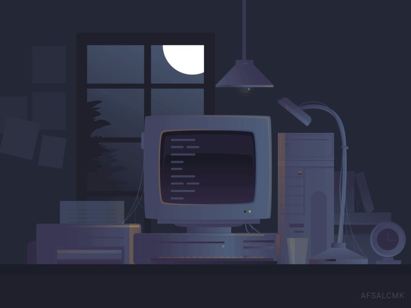

<h1 align="center">Saksham Mahajan</h1>

  

  <i>"Not every hero wears a cape. Some write code."</i>

---

I'm passionate about **Computer Vision**, **Deep Learning**, and **Embedded Systems**. I enjoy building intelligent systems, solving real-world problems, and contributing to open source.

### Currently Learning

* YOLO Object Detection
* Advanced Computer Vision
* Deep Learning

## Tech Stack

### Languages

### AI & Computer Vision

### Embedded Systems

### Tools & IDEs

---

  <i>"With great code comes great responsibility."</i>

